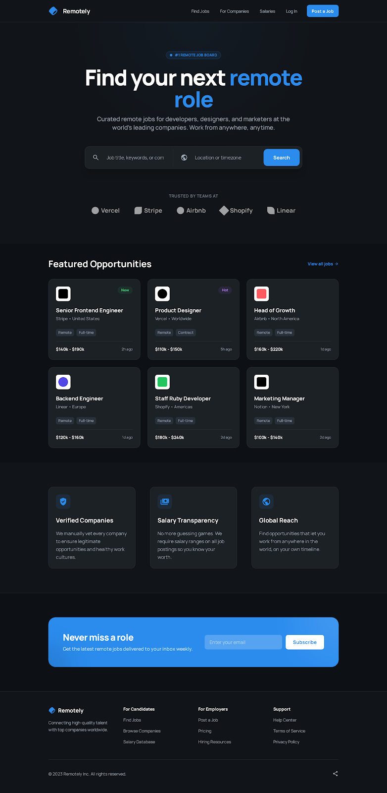
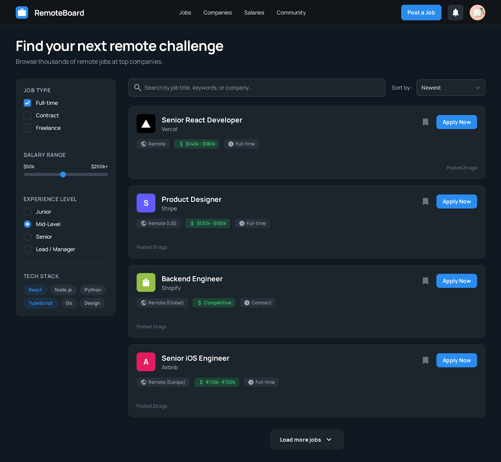
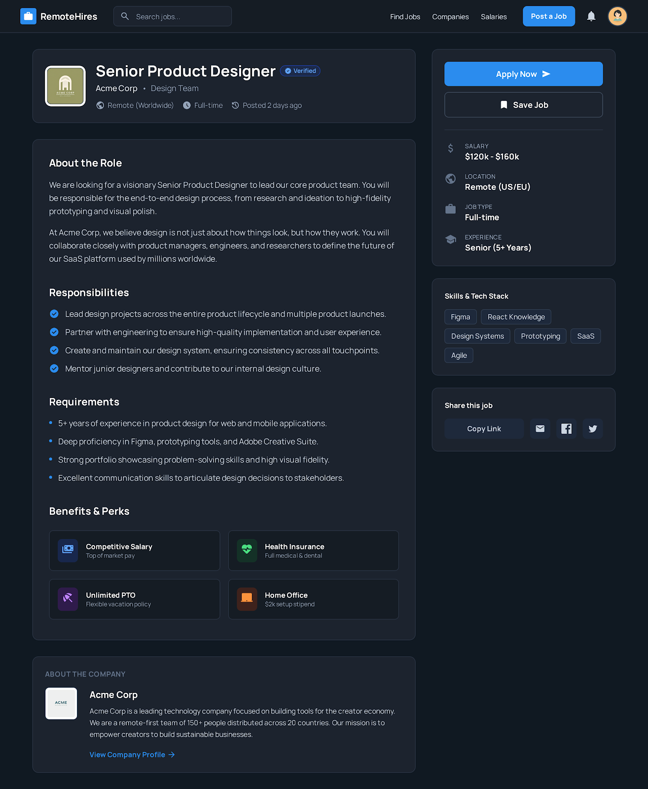
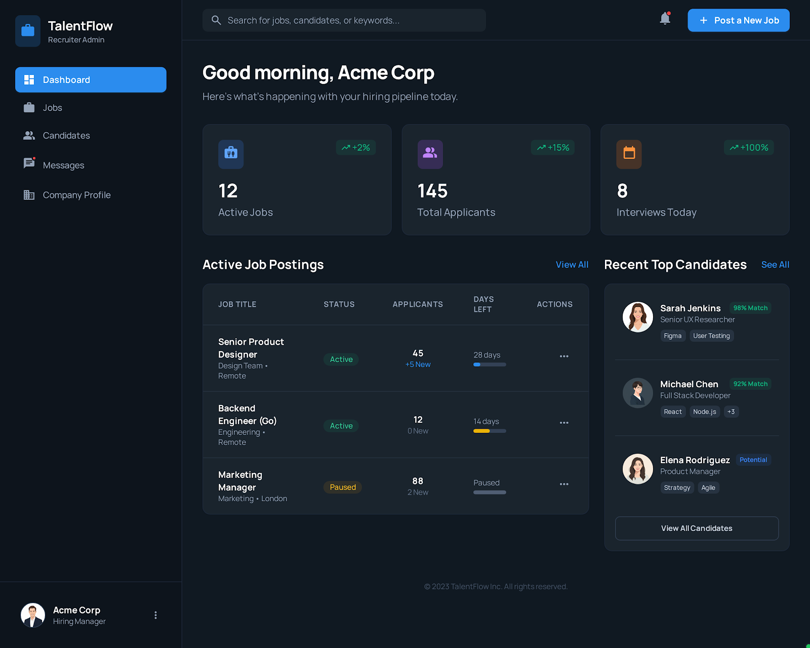
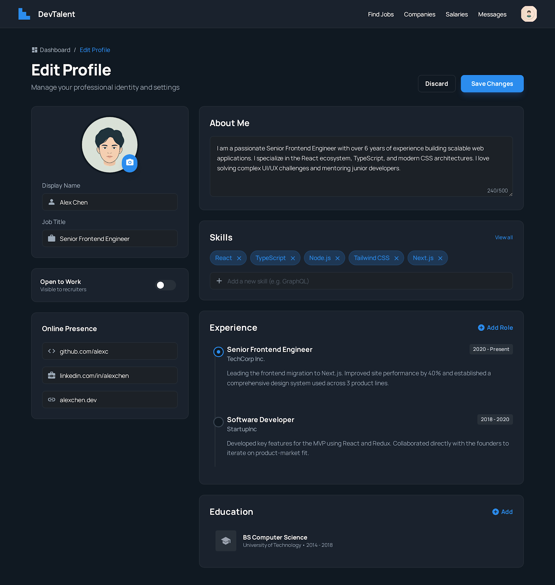

# Remotely - Remote Job Board Application

## Overview

A complete remote job board web application featuring multiple user interfaces for job seekers, employers, and general visitors. Built with modern design principles using Tailwind CSS and Material Icons, with full dark mode support.

## Application Pages

### Landing Page (index.html)

Hero section with search functionality, featured companies, and call-to-action sections



**Features:**

- Eye-catching hero section with job search
- Trusted companies showcase
- Why choose us section
- Responsive footer with navigation
- Dark mode support

---

### Browse Jobs (browse-jobs.html)

Job listing page with advanced filtering and search capabilities



**Features:**

- Sidebar with filters (Job Type, Salary Range, Experience Level, Tech Stack)
- Job cards with company logos and key details
- Search and sort functionality
- Responsive grid layout
- Clickable cards leading to job details

---

### Job Details (job-details.html)

Detailed job posting view with company information and application options



- Complete job description and requirements
- Company profile section
- Benefits and perks grid
- Apply and save functionality
- Skills tags and sharing options
- Sticky sidebar with job metadata

---

### Job Seeker Dashboard (dashboard.html)

Personalized dashboard for job seekers tracking applications and opportunities


**Features:**

- Activity statistics (Applications, Saved Jobs, Profile Views)
- Recommended jobs section
- Recent applications tracker with status
- Sidebar navigation
- Search functionality
- Responsive design

---

### Employer Dashboard (employer-dashboard.html)

Company dashboard for managing job postings and viewing candidates



**Features:**

- Active jobs overview with metrics
- Applicant statistics
- Interview scheduling
- Job posting management table
- Top candidates showcase
- Analytics and insights

---

### Professional Profile (profile.html)

User profile editor for job seekers to manage their professional information



**Features:**

- Profile photo upload
- Skills management with tags
- Experience timeline
- Education section
- Social links integration
- Availability status toggle
- About me section

---

## Navigation Structure

```
Landing Page (index.html)
    ├── Browse Jobs → Job Details
    ├── For Companies → Employer Dashboard
    ├── Log In → Job Seeker Dashboard
    └── Create Account → Job Seeker Dashboard

Job Seeker Dashboard (dashboard.html)
    ├── Find Jobs → Browse Jobs
    ├── Saved Jobs
    ├── Profile → Profile Editor
    └── Settings

Employer Dashboard (employer-dashboard.html)
    ├── Jobs → Browse Jobs
    ├── Candidates → Job Seeker Dashboard
    ├── Messages
    └── Company Profile → Profile Editor

All pages include:
    ├── Home link → Landing Page
    ├── Jobs link → Browse Jobs
    └── Profile link → Profile/Dashboard
```

## File Structure

```
remotely_app/
├── index.html              # Landing page
├── browse-jobs.html        # Job listings
├── job-details.html        # Individual job view
├── dashboard.html          # Job seeker dashboard
├── employer-dashboard.html # Employer dashboard
├── profile.html           # Profile editor
├── images/                # Screenshots (add your own!)
├── take-screenshots.sh    # Helper script
├── README.md             # This file
└── QUICK_START.md        # Quick reference
```
